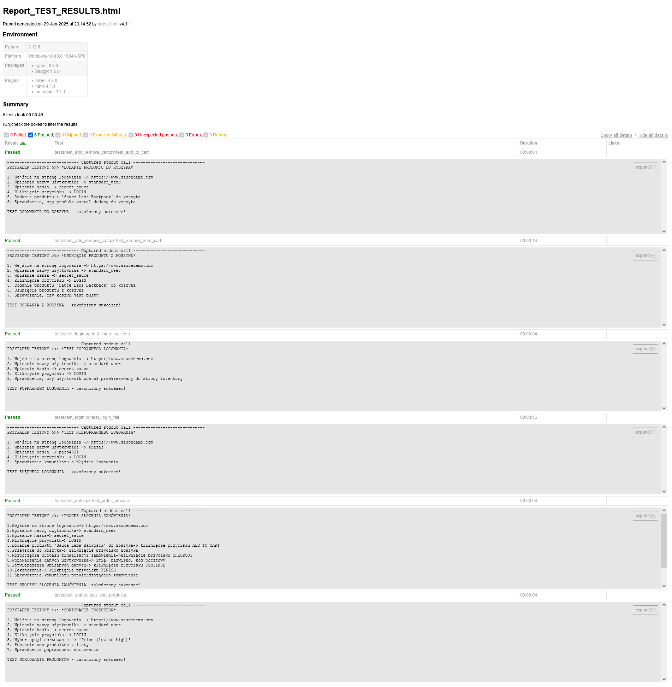
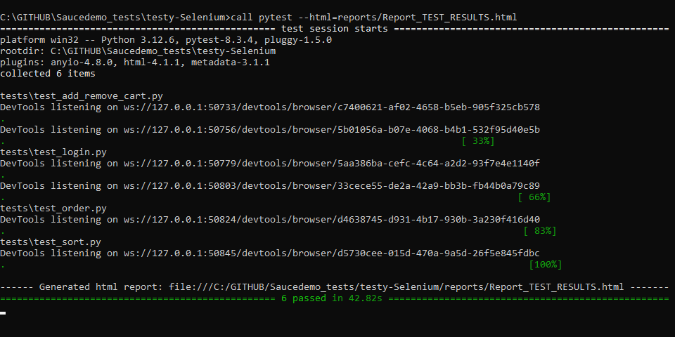
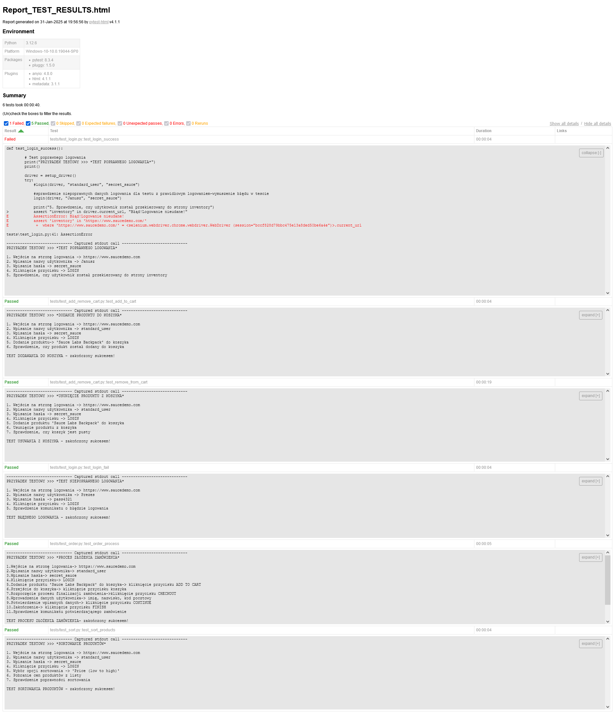
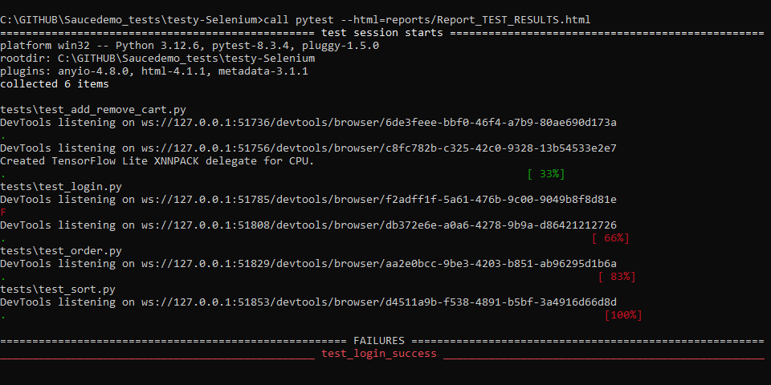

# testy-Selenium
Automatyczne testy aplikacji e-commerce-analizowanie dynamicznych elementów na stronie oraz generowanie raportu wyników
  
  

Wymagania:
  
  
-Google Chrome
  
-WebDriver zgodny z wersją Chroma >>> https://googlechromelabs.github.io/chrome-for-testing/ należy umieścić w folderze /drivers
  
-Selenium
  
-pytest
  
-pytest-html
  
  
Uruchomienie metody:
  
  
-Bezpośrednio z użyciem pliku bat 
  
-Wywołanie z terminala 'pytest --html=reports/Report_TEST_RESULTS.html'
  
  
Uzyskane wyniki:
  
WYNIKI PYTEST-HTML>>>
  

   
OKNO PYTEST>>>
  

  
  
 
Aby zademonstrować obsługę błędów, dodałem przykład testu aby celowo zakończył się niepowodzeniem. W tym przypadku zmieniłem login na "Janusz", co spowodowało, że test `test_login_success` zakończył się błędem. Pozostałe testy zostały wykonane prawidłowo.Na poniższym screenie widać błąd asercji, który łatwo można zdiagnozować jako przyczynę błędu czyli nieprawidłowy login "Janusz" powoduje, że logowanie nie jest pomyślne:
  
  
WYNIKI PYTEST-HTML>>>

   
OKNO PYTEST>>>
  

